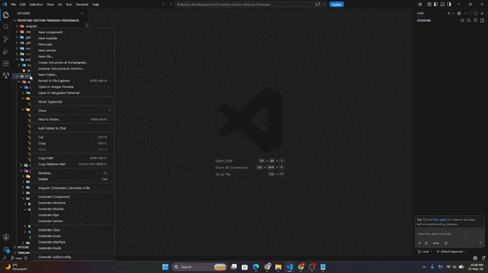
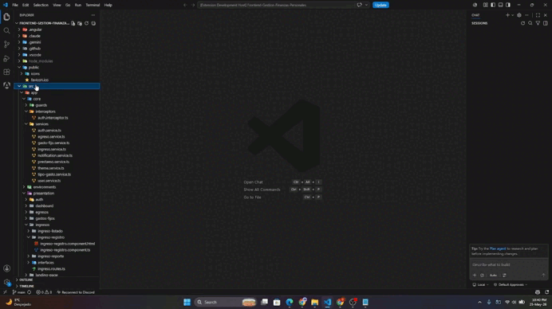

# Folder Structure Viewer


**Folder Structure Viewer** es una extensión simple pero potente para Visual Studio Code que te permite generar rápidamente una representación en texto de la estructura de directorios de tu proyecto. Es perfecta para documentación, compartir la disposición de un proyecto, o simplemente para tener una vista de pájaro de un nuevo código base.

---

## Características Principales

- **Exclusión Interactiva de Carpetas:** Visualiza un árbol interactivo de tu proyecto y selecciona con casillas de verificación exactamente qué subcarpetas omitir antes de generar la estructura.
- **Menú Contextual Rápido:** Accede a todas las funciones con un simple clic derecho sobre cualquier carpeta en el explorador de archivos.
- **Generación de Árbol de Directorios:** Crea una representación visual y anidada de tus carpetas y archivos.
- **Copia Directa al Portapapeles:** Genera y copia la estructura de una carpeta al portapapeles con una sola acción.
- **Contenido Personalizable:** Elige si quieres incluir solo las carpetas o tanto carpetas como archivos.
- **Nombre de Archivo Flexible:** ¡Tú decides cómo se llamará el archivo de salida!
- **Ignora Archivos Irrelevantes:** Por defecto, ignora directorios comunes como `.git`, `node_modules`, `dist`, etc.
- **Patrones de Ignorar Configurables:** Añade tus propias carpetas o archivos a la lista de ignorados mediante la configuración global.
- **Soporte para Multi-Root Workspaces:** El comando original de la paleta sigue funcionando perfectamente en entornos con múltiples carpetas.

---

## ¿Cómo se Usa?

### Método 1: Desde el Explorador de Archivos (Recomendado)

Esta es la forma más rápida y directa de usar la extensión.

1.  En el explorador de archivos de VS Code, haz **clic derecho** sobre la carpeta que deseas analizar.
2.  En el menú contextual, elige una de las opciones:
    - **`Generar Estructura en Archivo...`**
    - **`Copiar Estructura al Portapapeles`**
3. Selecciona el tipo de contenido ("Carpetas y archivos" o "Solo carpetas").
4. Elige si deseas generar la estructura directamente o **excluir carpetas específicas** mediante una interfaz interactiva.
5. Si elegiste generar un archivo, define el nombre del archivo de salida.

### Método 2: Desde la Paleta de Comandos

Este método es útil si no tienes una carpeta visible o trabajas en un workspace con múltiples raíces.

1.  Abre la **Paleta de Comandos**:
    - `Ctrl+Shift+P` en Windows/Linux
    - `Cmd+Shift+P` en macOS
2.  Escribe y selecciona el comando **`Generar estructura de carpetas (desde Paleta de Comandos)`**.
3.  Sigue los pasos interactivos en pantalla.

---

## Demostraciones

### 1. Demostración Normal
Flujo rápido de generación de estructura con configuración por defecto.


### 2. Exclusión de Carpetas y Generación de Archivo TXT
Selección de subcarpetas específicas a ocultar mediante la interfaz interactiva y guardado en archivo de texto.



### 3. Exclusión de Carpetas y Copiado al Portapapeles
Selección de carpetas a omitir y copiado directo de la estructura resultante al portapapeles.



---

## Configuración

Puedes personalizar los patrones de archivos y carpetas a ignorar de manera global.

1.  Abre la configuración de VS Code (`Archivo > Preferencias > Configuración` o `Ctrl+,`).
2.  Busca `folderStructureViewer.ignorePatterns`.
3.  O, directamente en tu archivo `settings.json`, añade la siguiente propiedad:

**Ejemplo (`settings.json`):**

```json
{
  "folderStructureViewer.ignorePatterns": [
    "logs",
    ".cache",
    "*.tmp",
    "__pycache__"
  ]
}
```

---

## Historial de Cambios (Changelog)

### 3.0.0

- **¡NUEVO!** Interfaz gráfica (Webview) interactiva para explorar y excluir carpetas dinámicamente antes de generar la estructura.
- **¡NUEVO!** Selección en cascada en la interfaz: al excluir una carpeta padre, se deshabilitan y excluyen automáticamente sus hijos.
- **¡NUEVO!** Diseño de interfaz nativo con guías de indentación visuales que se adaptan al tema de VS Code.
- Mejora en el sistema de filtrado interno para procesar de forma precisa rutas absolutas y relativas.

### 2.0.0

- **¡NUEVO!** Menú contextual en el explorador de archivos.
- **¡NUEVO!** Opción para "Generar Estructura en Archivo..." directamente con clic derecho en una carpeta.
- **¡NUEVO!** Opción para "Copiar Estructura al Portapapeles" directamente con clic derecho.
- Refactorización interna del código para mejorar el rendimiento y la mantenibilidad.

### 1.0.0

- Lanzamiento inicial de **Folder Structure Viewer**.
- Funcionalidad para generar árbol de directorios y archivos.
- Soporte para workspaces multi-raíz.
- Opción para elegir el nombre del archivo de salida.
- Botón para copiar el resultado al portapapeles.
- Patrones de ignorar personalizables.

---

## Para Desarrolladores

Si quieres contribuir o modificar el proyecto:

1.  Clona el repositorio.
2.  Ejecuta `npm install` para instalar las dependencias.
3.  Presiona `F5` en VS Code para iniciar una sesión de depuración.

---

**¡Disfruta de la extensión!**